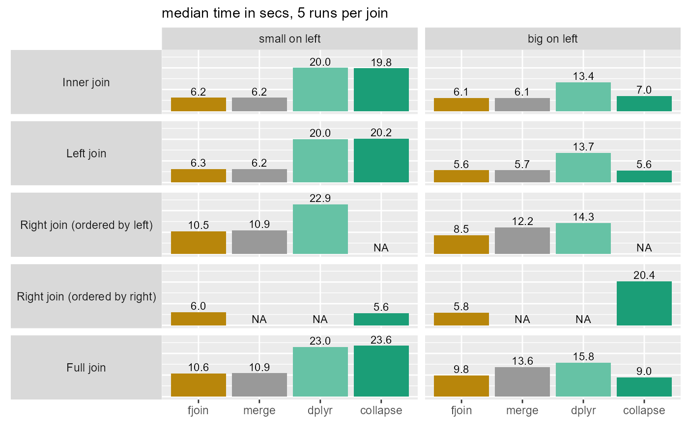
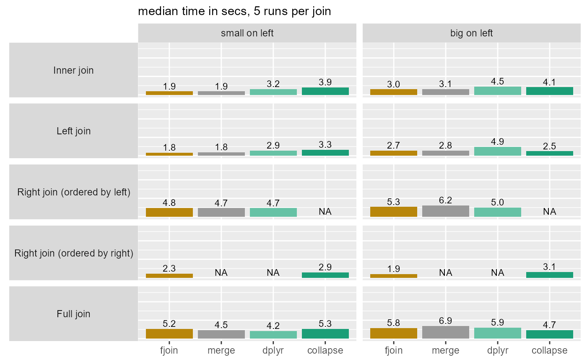
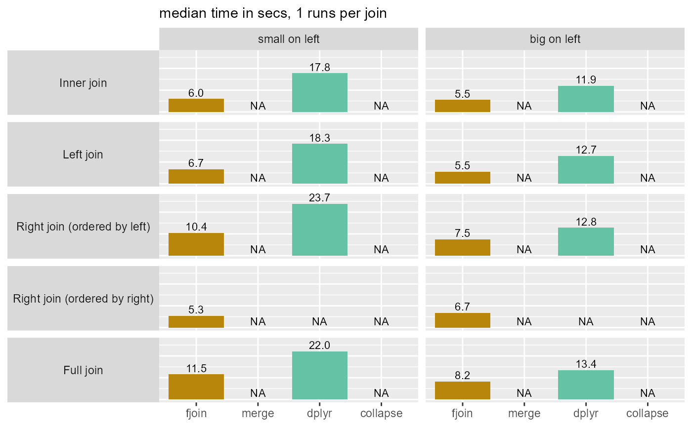
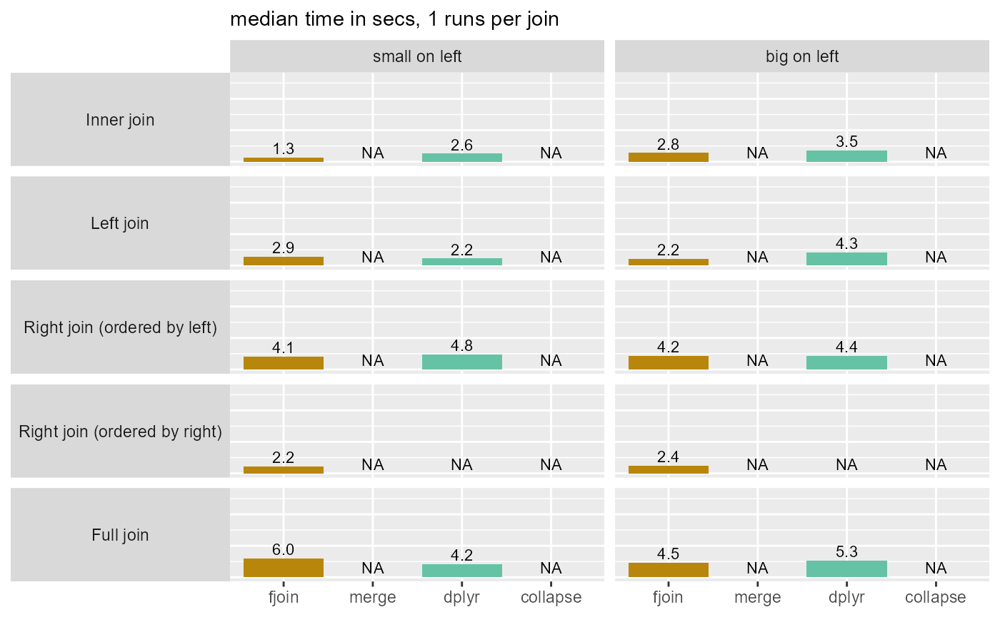

# Performance check of fjoin against merge.data.table, dplyr, collapse

This exercise checks the performance of fjoin against data.table
[`merge()`](https://rdrr.io/r/base/merge.html)
(i.e. `merge.data.table`), dplyr, and collapse on simple equality joins
with moderately large laptop-size data. It does not do justice to the
much more comprehensive join functionality offered by fjoin and dplyr
compared with the other two.

### Description

The setup consists of two `data.table`s, one “big” (\>4GB, 100M rows)
and one “small” (100K rows), joined by equality on a single integer
column. The test covers the four true joins (inner, left, right, full),
swapping the argument positions of the big and small tables. Both tables
are randomly ordered in the first set of runs, and keyed in the second.
All solutions are tested with like-for-like arguments.

The exercise is then repeated for the case where there are missing
values in the join column on each side, which must not be treated as
matches (but whose rows must be retained in the result where
appropriate). This comparison is limited to fjoin and dplyr, which are
the only two supporting this option.

Details plus version and system information are at the bottom of this
note.

### Results

##### 1a: No missing values, tables unordered

| solution | total_secs |
|:---|---:|
| fjoin | 44.7 |
| merge | 48.7 |
| dplyr | 105.8 |
| collapse | 85.1 |
|  NB: Total is sum of median times for inner, left, and full joins. Right joins excluded as not comparable. |  |

##### 1b: No missing values, both tables keyed

| solution | total_secs |
|:---|---:|
| fjoin | 20.4 |
| merge | 21.1 |
| dplyr | 25.6 |
| collapse | 23.8 |
|  NB: Total is sum of median times for inner, left, and full joins. Right joins excluded as not comparable. |  |

##### 2a: Missing values (matches disallowed), tables unordered

| solution | total_secs |
|:---|---:|
| fjoin | 43.4 |
| merge | NA |
| dplyr | 96.2 |
| collapse | NA |
|  NB: Total is sum of median times for inner, left, and full joins. Right joins excluded for comparability with the previous scenario. |  |

##### 2b: Missing values (matches disallowed), both tables keyed

| solution | total_secs |
|:---|---:|
| fjoin | 19.7 |
| merge | NA |
| dplyr | 22.1 |
| collapse | NA |
|  NB: Total is sum of median times for inner, left, and full joins. Right joins excluded for comparability with the previous scenario. |  |

#### Main observations

- fjoin is the fastest solution overall (while dplyr is the least fast),
  and is never appreciably slower than another solution in any of the
  ~40 joins considered.

- Its performance on inner and left joins is identical to
  `merge.data.table()` (where comparison is possible) since both use
  equivalent and straightforward data.table code. However, it is faster
  for right and full joins when the cost of the join is large, because
  it avoids recomputing it to obtain the anti-join of the right table.

- These two data.table solutions are much more robust to switching the
  order of the tables than collapse and dplyr.

- When the data are ordered, the differences among the solutions are
  negligible: they are all fast.

- Disallowing `NA` matches is fast (this is the case for dplyr also).
  (Timings are also affected by the smaller size of the join result when
  missing values are introduced and excluded.)

### Setup details

##### Data

- Two tables, each with an integer join column `id` and other columns
  numeric.
  - `big`: 100M rows, 6 columns, size 4.1GB
  - `small`: 100K rows, 3 columns, size 2MB
- The cardinality is M:1 from `big` to `small`. Both tables have 100K
  distinct values of `id`. In `small` these are unique while in `big`
  each `id` is present 1K times.
- In each table 90% of the distinct `id`s (and hence of the rows) have a
  match in the other table.
- Initially both tables are randomly ordered and there are no missing
  `id`s in either table. In scenarios with missing `id`s, 5% of the
  values of `id` in each table are `NA`.

##### Solutions

All solutions are tested with like-for-like arguments, suspending any
differences in their defaults:

- no cardinality checks
  (`dplyr::*_join(..., relationship = "many-to-many")`)
- no post-join sorting (`merge(..., sort = FALSE)`)
- no tests for `NA`/`NaN` values
  (`fjoin::fjoin_*(..., match.na = TRUE)`)
- multiple matches accepted (`collapse::join(..., multiple = TRUE)`)

In the scenario with missing values, the dplyr solutions are run with
the further argument `na.matches = "never"`, while fjoin is run on
default arguments, which exclude such matches.

##### Version and system info

    ## data.table 1.17.0
    ## dplyr 1.1.4
    ## collapse 2.0.19
    ## R version 4.4.2 (2024-10-31 ucrt)
    ## Windows
    ## Intel(R) Core(TM) i7-10750H CPU @ 2.60GHz
    ## Cores: 6
    ## Threads: 12
    ## RAM (GB): 31.8
