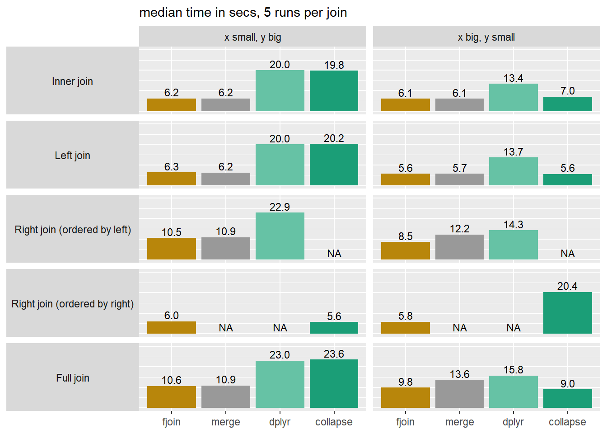

# Guide to fjoin

fjoin builds on data.table to provide fast, flexible joins on any data
frames. It slots into tidyverse pipelines and general workflows in a
single line, and provides NA-safe matching by default, on-the-fly column
selection, flexible row-order preservation, multiple-match handling on
both sides, and an indicator column for row origin.

## Installation

Latest development version ([R-universe](https://trobx.r-universe.dev)):

``` r
install.packages("fjoin", repos = c("https://trobx.r-universe.dev"))
```

Stable release (CRAN):

``` r
install.packages("fjoin")
```

## Features

- **Scope:** Inner, left, right, full, semi-, and anti-joins with
  equality and inequality conditions, plus cross joins.
- **Compatibility:** Accepts any mix of data frame-like objects or
  `list`s of same-length vectors, and returns a plain `data.frame`,
  (grouped) tibble, `data.table`, `sf`, or `sf`-tibble. Refreshes
  dynamic attributes like `groups`, keys, `agr`, and `bbox` in the
  output.
- **Performance:** Uses case-specific data.table solutions specially
  developed for high performance, and avoids data-copying at any stage
  for memory-efficiency.
- **Transparency:** “Just works” for general users, but you can also
  view the resulting data.table code instead of (or as well as)
  executing it, or run “mock” joins without data that output template
  code.
- **Low dependency:** Depends only on data.table, a mature,
  dependency-free package emphasising long-term stability.

fjoin provides several distinctive options and controls, including:

- **NA-safe joins by default:** Missing values are treated sensibly (no
  matches on `NA` unless you actually ask for them with
  `match.na = TRUE`).
- **On-the-fly column selection:** Choose and order columns with
  `select` for efficient one-liners.
- **Row origin tagging:** Add a Stata-style marker column showing each
  row’s source with `indicate`.
- **Multiple-match handling on both sides:** Arguments `mult.x` and
  `mult.y` specify how to handle multiple matches on either or both
  sides of the join, including in semi- and anti-joins.
- **Flexible order:** Control which data frame’s row order is preserved
  in the result (without expensive sorting) using `order`.

## API

[TABLE]

The `fjoin_*` family consists of conventional left/right-style join
functions. They are wrappers around the `dtjoin_*` functions (also
exported), which write the join code and handle execution, using an
interface that generalises data.table’s `DT[i]` join syntax.

## Examples

``` r
library(fjoin)
read_df <- function(x) data.table::fread(x, quote = "'", data.table = FALSE)
```

### Example 1: Basic use and options

Plain data frames joined by simple equality, using
[`fjoin_full()`](https://trobx.github.io/fjoin/reference/fjoin_full.md)
for illustration.

``` r
dfP <- read_df("
id     item price other_cols
NA   apples    10        ...
 3  bananas    20        ...
 2 cherries    30        ...
 1    dates    40        ...
")

dfQ <- read_df("
id quantity       note  other_cols
 2        5         ''         ...
 1        6         ''         ...
 3        7         ''         ...
NA        8  'oranges'         ...
")
```

#### (1) Basic syntax

``` r
fjoin_full(dfQ, dfP, on = "id")
```

      id quantity    note other_cols     item price R.other_cols
    1  2        5                ... cherries    30          ...
    2  1        6                ...    dates    40          ...
    3  3        7                ...  bananas    20          ...
    4 NA        8 oranges        ...     <NA>    NA         <NA>
    5 NA       NA    <NA>       <NA>   apples    10          ...

Notice that the default `match.na = FALSE` avoids an apples-and-oranges
match on missing values — other R frameworks would join the last two
rows.

#### (2) Efficient selective joins in one line

Use `select` to restrict the join to particular columns and put them in
desired order:

``` r
fjoin_full(dfQ, dfP, on = "id", select = c("item", "price", "quantity"))
```

      id     item price quantity
    1  2 cherries    30        5
    2  1    dates    40        6
    3  3  bananas    20        7
    4 NA     <NA>    NA        8
    5 NA   apples    10       NA

This code is much easier to write and read than the equivalent operation
in dplyr, which requires two calls before the join to avoid inflating it
with irrelevant columns, and a call after it to shuffle column order:

``` r
x <- dfQ |> select(id, quantity)
y <- dfP |> select(id, item, price)
full_join(x, y, join_by(id), na.matches = "never") |>
  select(id, item, price, quantity)
```

#### (3) Indicator column for row origin

`1L`: left only, `2L`: right only, `3L`: joined from both. This
extremely useful feature has existed in Stata since 1984[^1]

``` r
fjoin_full(
  dfQ,
  dfP,
  on = "id",
  select = c("item", "price", "quantity"),
  indicate = TRUE
)
```

      .join id     item price quantity
    1     3  2 cherries    30        5
    2     3  1    dates    40        6
    3     3  3  bananas    20        7
    4     1 NA     <NA>    NA        8
    5     2 NA   apples    10       NA

#### (4) Switch row order from left-then-right to right-then-left

``` r
fjoin_full(
  dfQ,
  dfP,
  on = "id",
  select = c("item", "price", "quantity"),
  indicate = TRUE,
  order = "right"
)
```

      .join id     item price quantity
    1     2 NA   apples    10       NA
    2     3  3  bananas    20        7
    3     3  2 cherries    30        5
    4     3  1    dates    40        6
    5     1 NA     <NA>    NA        8

#### (5) Display code instead of executing

For data.table users.

``` r
fjoin_full(
  dfQ,
  dfP,
  on = "id",
  select = c("item", "price", "quantity"),
  indicate = TRUE,
  order = "right",
  do = FALSE
)
```

    .DT : x = dfQ (cast as data.table)
    .i  : y = dfP (cast as data.table)
    Join: setDF(with(list(fjoin.temp = setDT(.DT[, fjoin.which.DT := .I][, na.omit(.SD, cols = "id"), .SDcols = c("id", "quantity", "fjoin.which.DT")][, fjoin.ind.DT := TRUE][.i, on = "id", data.frame(.join = fifelse(is.na(fjoin.ind.DT), 2L, 3L), id, item, price, quantity, fjoin.which.DT), allow.cartesian = TRUE])), rbind(fjoin.temp, setDT(.DT[!fjoin.temp$fjoin.which.DT, data.frame(id, quantity, fjoin.which.DT, .join = rep(1L, .N))]), fill = TRUE))[, fjoin.which.DT := NULL])[]

### Example 2: Reducing an inequality join from M:M to 1:1 with `mult.x` and `mult.y`

data.table (`mult`) and dplyr (`multiple`) can reduce the cardinality on
one side of the join from many (`"all"`) to one (`"first"` or `"last"`).
fjoin (`mult.x`, `mult.y`) will do this on either side of the join, or
on both sides at the same time. This example (using
[`fjoin_left()`](https://trobx.github.io/fjoin/reference/fjoin_left.md))
shows an application to temporally ordered data frames of generic
“events” and “reactions”.

``` r
events <- read_df("
event_id event_ts
       1       10
       2       20
       3       40
")

reactions <- read_df("
reaction_id reaction_ts
          1          30
          2          50
          3          60
")
```

#### (1) For each event, all subsequent reactions (M:M)

``` r
fjoin_left(
  events,
  reactions,
  on = c("event_ts < reaction_ts")
)
```

      event_id event_ts reaction_id reaction_ts
    1        1       10           1          30
    2        1       10           2          50
    3        1       10           3          60
    4        2       20           1          30
    5        2       20           2          50
    6        2       20           3          60
    7        3       40           2          50
    8        3       40           3          60

#### (2) For each event, the next reaction (1:M)

Equivalent to a one-way forward rolling join.

``` r
fjoin_left(
  events,
  reactions,
  on = c("event_ts < reaction_ts"),
  mult.x = "first"
)
```

      event_id event_ts reaction_id reaction_ts
    1        1       10           1          30
    2        2       20           1          30
    3        3       40           2          50

#### (3) For each event, the next reaction, provided there was no intervening event (1:1)

Equivalent to a two-way rolling join (mutual forward/backward rolling
matches).

``` r
fjoin_left(
  events,
  reactions,
  on = c("event_ts < reaction_ts"),
  mult.x = "first",
  mult.y = "last"
)
```

      event_id event_ts reaction_id reaction_ts
    1        1       10          NA          NA
    2        2       20           1          30
    3        3       40           2          50

### Example 3: Chain of calls from `fjoin_*` to `dtjoin_*` to data.table

A technical illustration showing:

- two calls to
  [`fjoin_left()`](https://trobx.github.io/fjoin/reference/fjoin_left.md)
  (commented out), differing in the `order` argument
- the resulting calls to
  [`dtjoin()`](https://trobx.github.io/fjoin/reference/dtjoin.md), with
  the addition of `show = TRUE`
- the generated data.table code and its output

``` r
df_x <- data.frame(id_x = 1:3, row_x = paste0("x", 1:3))
df_y <- data.frame(id_y = rep(4:2, each = 2L), row_y = paste0("y", 1:6))
```

``` r
# (1) fjoin_left(df_x, df_y, on = "id_x == id_y", mult.x = "first")
dtjoin(
  df_y,
  df_x,
  on = "id_y == id_x",
  mult = "first",
  i.home = TRUE,
  prefix = "R.",
  show = TRUE
)
```

    .DT : df_y (cast as data.table)
    .i  : df_x (cast as data.table)
    Join: .DT[.i, on = "id_y == id_x", mult = "first", data.frame(id_x, row_x, row_y)]

      id_x row_x row_y
    1    1    x1  <NA>
    2    2    x2    y5
    3    3    x3    y3

``` r
# (2) fjoin_left(df_x, df_y, on = "id_x == id_y", mult.x = "first", order = "right")
dtjoin(
  df_x,
  df_y,
  on = "id_x == id_y",
  mult.DT = "first",
  nomatch = NULL,
  nomatch.DT = NA,
  prefix = "R.",
  show = TRUE
)
```

    .DT : df_x (cast as data.table)
    .i  : df_y (cast as data.table)
    Join: setDF(with(list(fjoin.temp = setDT(setDT(.i[, fjoin.which.i := .I][.DT[, fjoin.which.DT := .I], on = "id_y == id_x", nomatch = NULL, mult = "first", data.frame(id_x = i.id_x, row_x = i.row_x, fjoin.which.DT = i.fjoin.which.DT, fjoin.which.i)])[.i, on = "fjoin.which.i", nomatch = NULL, data.frame(id_x = i.id_y, row_x, fjoin.which.DT, row_y)])), rbind(fjoin.temp, setDT(.DT[!fjoin.temp$fjoin.which.DT, data.frame(id_x, row_x, fjoin.which.DT)]), fill = TRUE))[, fjoin.which.DT := NULL])[]

      id_x row_x row_y
    1    3    x3    y3
    2    2    x2    y5
    3    1    x1  <NA>

The difference in the `order` argument passed to `fjoin_*()` is
reflected at
[`dtjoin()`](https://trobx.github.io/fjoin/reference/dtjoin.md) level in
the identity of the tables passed to `.DT` and `.i`, the values of the
extended arguments `nomatch.DT` and `mult.DT` (counterparts to the
familiar data.table arguments `nomatch` and `mult` on the other side of
the join), and a compensating argument `i.home` which toggles the “home”
and “foreign” table for the purposes of column order and prefixing (as
well as for `indicate` and output class).
[`dtjoin()`](https://trobx.github.io/fjoin/reference/dtjoin.md) in turn
translates these specifications into data.table code for execution. See
the [`dtjoin()`](https://trobx.github.io/fjoin/reference/dtjoin.md)
documentation for full details of this extended `DT[i]`-style syntax.

## Performance



The benchmark above is based on a no-frills equality join to allow
comparison with `merge.data.table` and
[`collapse::join()`](https://fastverse.org/collapse/reference/join.html);
see the
[Performance](https://trobx.github.io/fjoin/articles/fjoin-performance.html)
article for more detail. In the inner and left joins, fjoin and
`merge.data.table` reflect a simple operation in data.table, and
straightforwardly inherit its speed and robustness to the order of the
tables. But fjoin performs a bit better than `merge.data.table` on the
right and full joins. This is typical: fjoin’s solutions for join types
and additional options that are not straightforward in native data.table
have been developed with close attention to performance.

## Notes for tidyverse users

fjoin is a drop-in alternative to `dplyr::*_join()` with fast large data
performance and useful options that `dplyr::*_join()` lacks (though the
reverse is also true — see below). Joins are fairly infrequent
operations, and the package name is short, so you may not feel the need
to attach it:

``` r
library(dplyr)
dfQ <- as_tibble(dfQ)

dfQ |>
  fjoin::fjoin_full(dfP,
    on = "id",
    select = c("item", "price", "quantity"),
    order = "right",
    indicate = TRUE
  ) |>
  mutate(
    quantity = if_else(.join == 2L, 0L, quantity),
    revenue  = price * quantity
  )
```

    # A tibble: 5 × 6
      .join    id item     price quantity revenue
      <int> <int> <chr>    <int>    <int>   <int>
    1     2    NA apples      10        0       0
    2     3     3 bananas     20        7     140
    3     3     2 cherries    30        5     150
    4     3     1 dates       40        6     240
    5     1    NA <NA>        NA        8      NA

Please note that fjoin, for now, has no equivalent of
`dplyr::*_join()`’s `relationship` validation: it is silent and
permissive about cardinality. It also doesn’t yet support rolling joins
on unordered data, which dplyr implements elegantly via a helper
function in `join_by`, or dedicated overlap joins (although these are
easily written in terms of inequalities). These features will be added.

The implementation of joins in the data.table-backed packages dtplyr and
tidytable needs maintenance. In both cases it only supports equality
joins, malfunctions in the presence of same-named non-join columns on
each side (try it), and silently ignores dplyr’s additional join
arguments such as `na.matches` and `multiple` (as well as
`relationship`). These packages are excellent tools that do much more
than just joins, but you should be aware of these limitations.

## Notes for sf users

``` r
countries <- read_df("
country_id   country_name                          country_shape
         1     'Country A'  'POLYGON ((0 0, 1 0, 1 1, 0 1, 0 0))'     
         2     'Country B'  'POLYGON ((1 1, 2 1, 2 2, 1 2, 1 1))'    
         3     'Country C'  'POLYGON ((2 2, 3 2, 3 3, 2 3, 2 2))'    
") |> sf::st_as_sf(wkt = "country_shape", crs = 4326)

capitals <- read_df("
country_id  capital_name        capital_loc
         2       'City B'  'POINT (1.5 1.5)'    
         3       'City C'  'POINT (2.5 2.5)'    
         4       'City D'  'POINT (3.5 3.5)'    
") |> sf::st_as_sf(wkt = "capital_loc", crs = 4326)
```

fjoin smoothly accommodates joins involving `sf` data frames. In
particular, joins between two `sf` objects work as you would hope:

``` r
fjoin_inner(countries, capitals, on = "country_id")
```

    Simple feature collection with 2 features and 3 fields
    Active geometry column: country_shape
    Geometry type: POLYGON
    Dimension:     XY
    Bounding box:  xmin: 1 ymin: 1 xmax: 3 ymax: 3
    Geodetic CRS:  WGS 84
      country_id country_name                  country_shape capital_name
    1          2    Country B POLYGON ((1 1, 2 1, 2 2, 1 ...       City B
    2          3    Country C POLYGON ((2 2, 3 2, 3 3, 2 ...       City C
          capital_loc
    1 POINT (1.5 1.5)
    2 POINT (2.5 2.5)

This is useful in workflows where you want to hold multiple geometries
in the same `sf` data frame. In dplyr such joins are prohibited:

``` r
try(dplyr::inner_join(countries, capitals, by = "country_id"))
```

    Error : y should not have class sf; for spatial joins, use st_join

In addition, fjoin always detects and refreshes `sfc`-class columns in
the join output, regardless of whether the inputs and output have `sf`
class (and whether those columns were/are active geometries). This
avoids stale bounding boxes and ensures that values at non-matching rows
are converted from `NULL` to a valid empty geometry. For example, here
is the `sfc` column `capital_loc` from the input on the right, after a
left join in which the inputs are plain data frames instead of `sf`s:

``` r
fjoin_left(as.data.frame(countries), as.data.frame(capitals), on = "country_id")$capital_loc
```

    Geometry set for 3 features  (with 1 geometry empty)
    Geometry type: POINT
    Dimension:     XY
    Bounding box:  xmin: 1.5 ymin: 1.5 xmax: 2.5 ymax: 2.5
    Geodetic CRS:  WGS 84

    POINT EMPTY

    POINT (1.5 1.5)

    POINT (2.5 2.5)

## Notes for data.table users

fjoin automates joins that are challenging or laborious to write in
data.table, while solving frustrations such as garbled join columns in
inequality joins and the lack of an effective `incomparables` argument,
and providing other useful options. Even for very simple joins, there is
no reason *not* to use it, since it has negligible overhead and if
anything will actually slightly outperform `merge` (see above) and even
native data.table (see below).

That said, fjoin is not a comprehensive wrapper for data.table’s rich
join functionality. Some things it cannot do are:

- computing on joined columns inside `j` (including `by = .EACHI`
  aggregations), rather than simply selecting them
- joins by reference of the direct form `DT[i, on = <on> , v := i.v]`
- for now, dedicated rolling and overlap joins

You do have the option of setting `do = FALSE`, copying the console
output, and editing the `j`-expression(s). You can also “plonk” joined
columns by reference using the pattern
`DT[, v := fjoin_left(DT, i, on = <on>, select = "v")$v]`, which can
often usefully be combined with the `".join"` indicator:

``` r
library(data.table)
dtQ <- as.data.table(dfQ)
dtP <- as.data.table(dfP)

dtP[, revenue := 
      price * fjoin_left(
        dtP,
        dtQ,
        on = "id",
        select = c("quantity"),
        indicate = TRUE
      )[.join == 1L, quantity := 0L]$quantity][]
```

          id     item price other_cols revenue
       <int>   <char> <int>     <char>   <int>
    1:    NA   apples    10        ...       0
    2:     3  bananas    20        ...     140
    3:     2 cherries    30        ...     150
    4:     1    dates    40        ...     240

The package actually began life as a tool to solve data.table’s garbling
of join columns in non-equi joins. It still does that:

``` r
dt1 <- data.table(t=c(5L,25L,45L))
dt2 <- data.table(t_start=c(1L,21L), t_end=c(10L,30L))
```

Here is a range join with fjoin:

``` r
dtjoin(dt2, dt1, on=c("t_start <= t", "t_end >= t"), show = TRUE)
```

    .DT : dt2
    .i  : dt1
    Join: setDT(.DT[.i, on = c("t_start <= t", "t_end >= t"), data.frame(t_start = x.t_start, t_end = x.t_end, t)])[]

       t_start t_end     t
         <int> <int> <int>
    1:       1    10     5
    2:      21    30    25
    3:      NA    NA    45

Compare the default output from data.table:

``` r
dt2[dt1, on=.(t_start <= t, t_end >= t)]
```

       t_start t_end
         <int> <int>
    1:       5     5
    2:      25    25
    3:      45    45

Notice that fjoin uses
[`data.frame()`](https://rdrr.io/r/base/data.frame.html) in `j` (coupled
with an outer
[`setDT()`](https://rdrr.io/pkg/data.table/man/setDT.html)) instead of
the more usual [`list()`](https://rdrr.io/r/base/list.html), even when
the required output is a `data.table`. This is to sidestep an
unnecessary deep copy of the joined columns currently made by data.table
in this case. Likewise, fjoin avoids deep copies on the way in and out
by “shallow-casting” inputs and outputs to and from `data.table`s as
necessary. Shallow conversion is not a safe general way of operating
with foreign objects in data.table, but it works for joins, because the
input vectors only need to be read, and the output vectors are
guaranteed to be unshared.

One consequence of this is that fjoin can be more efficient than
data.table itself with standard interactive idioms. Consider the
following (exaggerated) example, where the `i` expression is a
`data.frame` and we select columns in `j` with
[`list()`](https://rdrr.io/r/base/list.html) (aliased `.()`):

``` r
n <- 1e6L; ncol_dt <- 2L; ncol_df <- 10L
dt <- data.table(id = rep(1:n, each = 5L), matrix(runif(n * ncol_dt), ncol = ncol_dt))
df <- data.frame(id = 1:n, matrix(runif(n * ncol_df), ncol = ncol_df))

bench::mark(
  data.table = dt[df, on = .(id), .(id, V1, V2, X1, X3, X5, X7, X9)],
  fjoin      = dtjoin(dt, df, on = "id", select.i = c("X1", "X3", "X5", "X7", "X9")),
  iterations = 3,
  check      = TRUE
) |> summary() |> subset(select = c("expression", "n_itr", "median",  "mem_alloc"))
```

    # A tibble: 2 × 3
      expression   median mem_alloc
      <bch:expr> <bch:tm> <bch:byt>
    1 data.table    396ms     752MB
    2 fjoin         167ms     367MB

Here fjoin avoids a call to `as.data.table.data.frame` on the way in,
and a call to `as.data.table.list` on the way out, both of which
(currently) always deep-copy. The
[`bench::mark`](https://bench.r-lib.org/reference/mark.html) memory
measurements [exclude C-level
allocations](https://rdatatable-community.github.io/The-Raft/posts/2025-07-14-memory_R-jangorecki/),
but the difference between them reflects these R-level copies. This
behaviour will eventually change in data.table, at which point fjoin
will revert to the more familiar `j = list()` idiom.

Finally, please note that
[`dtjoin()`](https://trobx.github.io/fjoin/reference/dtjoin.md) differs
from data.table in its preservation of keys. In a data.table `DT[i]`
join, the output inherits the key of `DT` provided it happens to remain
sorted on those columns; this is consistent with data.table’s conception
of joins as a subsetting-like operation on `DT`, even though it is the
`i`-table that dictates the row order. With
[`dtjoin()`](https://trobx.github.io/fjoin/reference/dtjoin.md), the
output always inherits the key of `.i` (unless the non-joining rows of
`.DT` are appended, in which case the key is `NULL` since sortedness on
`.i`’s key columns can no longer be guaranteed). This design choice
ensures intuitive behaviour of the `fjoin_*()` functions: for example,
`fjoin_left(x, y)` with the default `order = "left"` preserves `x`’s
key, as a user would surely expect.

## “Internals”

With `match.na = FALSE` (the default), fjoin inspects the data and, if
the join permits, chooses which table to omit `NA`-containing rows from
using a heuristic. The only thing that is not reflected in the
data.table code that fjoin produces are the input and output handling
steps:

- shallow-casting non-`data.table` inputs as `data.table`s (new objects
  borrowing columns from the input)
- adding (grouped) tibble and/or `sf` class to `data.frame` outputs
  where appropriate, including setting `groups` and `agr` attributes
- keying `data.table` outputs as described above
- refreshing `sfc` columns regardless of output class
- on exit, dropping temporary columns (pointers) from `data.table`
  inputs used as-is

These steps ensure that fjoin handles object classes efficiently (no
data copying) while leaving inputs intact.

In other respects, the package is a constructor of data.table code to a
set of carefully thought-out solutions. fjoin pays a lot of attention to
doing this well and is also very thoroughly tested.

[^1]: See p. 99 of the Stata 1 reference manual, which has been linked
    to on Statalist and can be found by searching online. Thanks to Nick
    Cox for this information.
